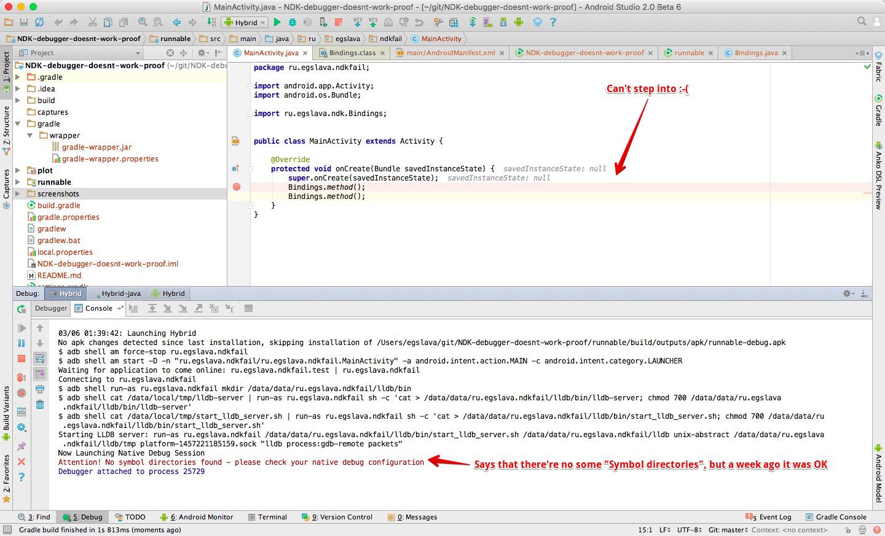

NDK Debugger just stopped work at all (but it worked a few days ago, "No symbol directories found") (proof)
=========
(this project is without .gitignore to ensure that you and me have exactly the same project)
It's a simple Android project built with two gradle plugins:

 1. New Experimental Plugin (for NDK) (0.6.0-beta2) (newest on 6 of March 2016)
 1. Casual Android Plugin (2.0.0-beta6) (newest on 6 of March 2016)
 
It compiles NDK-library plot-all-debug.aar (with help of experimental gradle plugin) and I move it into runnable/libs/plot-all-debug.aar. After, it consumes casual Java Android application (that is based on casual Android SDK plugin).

When I start debugging in Hybrid mode and I can stop only on breakpoints within Java Code. When I try to 
step into C++ code - it just hangs on (I'm about Nexus 5, Android Studio is fine).

I was debugging a much more complex project less than week ago. I don't know what happened but now I can't debug 
anything.

My system (newest Android Studio on 6 of March 2016):
 
    OS X El Capitan
    Android Studio 2.0 Beta 6
    Build #AI-143.2637817, built on February 26, 2016
    JRE: 1.6.0_65-b14-468-11M4833 x86_64
    JVM: Java HotSpot(TM) 64-Bit Server VM by Apple Inc.


## How to reproduce
Just clone the project and run it in (described above) necessary environment.

## What expected / what observed
**Expected**. work Java and C++ debugger: can stop on breakpoint in Java code and step into C++ code or just stop on 
breakpoint in C++ code.

**Observed**. can't step into C++ code, breakpoints in native code are just skipped.





## Debug Output
```
 03/06 02:04:22: Launching Hybrid
 $ adb push /Users/egslava/git/NDK-debugger-doesnt-work-proof/runnable/build/outputs/apk/runnable-debug.apk /data/local/tmp/ru.egslava.ndkfail
 $ adb shell pm install -r "/data/local/tmp/ru.egslava.ndkfail"
 	pkg: /data/local/tmp/ru.egslava.ndkfail
 Success
 
 
 $ adb shell am start -D -n "ru.egslava.ndkfail/ru.egslava.ndkfail.MainActivity" -a android.intent.action.MAIN -c android.intent.category.LAUNCHER
 Waiting for application to come online: ru.egslava.ndkfail.test | ru.egslava.ndkfail
 Connecting to ru.egslava.ndkfail
 $ adb shell run-as ru.egslava.ndkfail mkdir /data/data/ru.egslava.ndkfail/lldb/bin
 $ adb shell cat /data/local/tmp/lldb-server | run-as ru.egslava.ndkfail sh -c 'cat > /data/data/ru.egslava.ndkfail/lldb/bin/lldb-server; chmod 700 /data/data/ru.egslava.ndkfail/lldb/bin/lldb-server'
 $ adb shell cat /data/local/tmp/start_lldb_server.sh | run-as ru.egslava.ndkfail sh -c 'cat > /data/data/ru.egslava.ndkfail/lldb/bin/start_lldb_server.sh; chmod 700 /data/data/ru.egslava.ndkfail/lldb/bin/start_lldb_server.sh'
 Starting LLDB server: run-as ru.egslava.ndkfail /data/data/ru.egslava.ndkfail/lldb/bin/start_lldb_server.sh /data/data/ru.egslava.ndkfail/lldb unix-abstract /data/data/ru.egslava.ndkfail/lldb/tmp platform-1457222665316.sock "lldb process:gdb-remote packets"
 Now Launching Native Debug Session
 Attention! No symbol directories found - please check your native debug configuration
```
